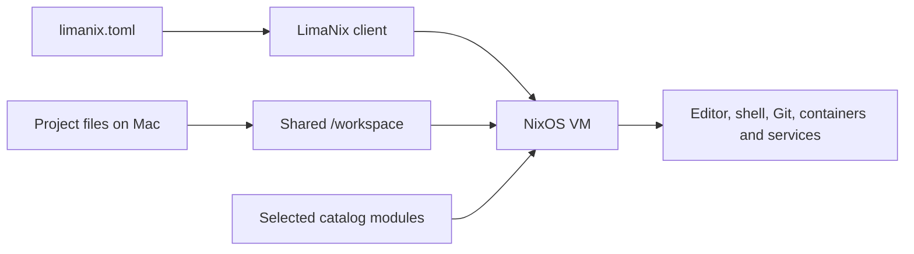

# LimaNix

A Linux development workspace for your Mac, described beside your project.

Keep project files on macOS and run Linux tools, containers and services in a
NixOS VM. LimaNix bundles Lima and a module catalog; your Mac does not need a
separate Lima or Nix installation.

## From project to workspace



| Start with | What you get | Guide |
| -- | -- | -- |
| Minimal VM | A consistent platform account, shell, mounts and guest interface | [Getting started](https://limanix.dev/categories/client/getting-started.html) |
| Cozy workbench | Named project windows, common languages and LSP, containers, cloud clients, HTTP and SQL tools | [Project workspace](https://limanix.dev/categories/client/workspace.html) |
| Your own selection | Independent modules and project-specific NixOS configuration | [Catalog](https://limanix.dev/categories/nixos/catalog.html) |

The shared platform works with any module selection. Optional modules add
capabilities through documented settings and interfaces. Cozy assembles those
components into one workbench; each remains available separately.

## Try it

1. [Install the client](https://limanix.dev/categories/client/getting-started.html#install-the-client)
   matching your Mac.
1. Save a project configuration and run `limanix create --config limanix.toml`
   on the Mac.
1. Open the guest with `limanix shell NAME` and run project commands at its
   mounted Linux path.

Creation needs network access for image and package downloads. An update
rebuilds the guest and restarts the VM. The managed home and project mounts keep
their host files; the guest disk has its own lifecycle. Read
[Storage and data](https://limanix.dev/categories/client/virtual-machines.html#storage-and-data)
before deleting a VM.

## Understand and extend it

| Need | Read |
| -- | -- |
| VM resources, mounts and environment | [Configuration](https://limanix.dev/categories/client/configuration.html) |
| Guest service access from the Mac | [Networking](https://limanix.dev/categories/client/networking.html) |
| Component responsibilities and public contracts | [Architecture](https://limanix.dev/categories/client/architecture.html) |
| A tool the catalog does not cover | [Write a module](https://limanix.dev/categories/nixos/writing-modules.html) |
| Exact flags and configuration fields | [Reference](https://limanix.dev/categories/client/reference.html) |
| Alternative workflows and trade-offs | [How LimaNix compares](comparison.md) |

## Project repositories

| Repository | Owns |
| -- | -- |
| [Client](https://github.com/limanix/client) | CLI, VM platform, lifecycle and configuration delivery |
| [Modules](https://github.com/limanix/modules) | Guest tools, application settings, capability providers and integrations |
| [Documentation](https://github.com/limanix/docs) | Shared pages, site theme, navigation and publication |

The [release process](releases/index.md) explains which client/catalog pairs are
published and how their documentation reaches this site.

```{toctree}
:hidden:
:maxdepth: 2
:caption: Project
:glob:

comparison
**/index
```
