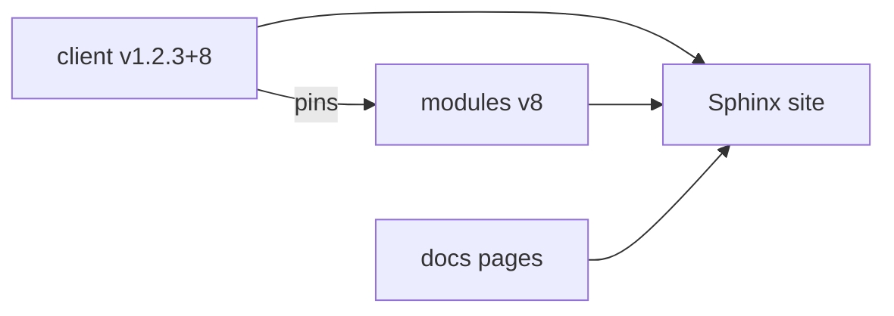

# Documentation builds

Each client release selects its own documentation sources. 
The site combines the client's guides and references with the catalog that client actually uses.

## Choose the sources

For an example client release `v1.2.3+8`:

| Source    | Selected state                                | Content                                                              |
|-----------|-----------------------------------------------|----------------------------------------------------------------------|
| `client`  | Tag `v1.2.3+8`                                | `client/docs/` and generated CLI, configuration, and TOML references |
| `modules` | Tag `v8`, read from that client's catalog pin | `modules/docs/`                                                      |
| `docs`    | The site's own source                         | Homepage, release process, navigation, and Sphinx Book Theme         |



1. Check out the exact client tag from the release notification.
2. Read its pinned catalog tag and check out that catalog.
3. Generate the client's CLI reference, configuration reference, and TOML example.
4. Assemble both repositories' documentation with the site's own pages.
5. Build with Sphinx and publish the result for the client line.

```{important}
Use the catalog pinned by the selected client. 
A newer module release does not change that client's documentation until a client build containing it is published.
```

Handwritten guides follow the same rule as generated references: read them from the selected tags. 
Changes on a repository's `main` branch do not belong to an older published client automatically.

## Keep three client lines

Keep one current documentation snapshot for each of the three supported `MAJOR.MINOR` lines. 
Show the line in the version switcher and the exact client and catalog tags inside its pages.

An example published set:

| Site section | Client build | Catalog |
|--------------|--------------|---------|
| `/v1.0/`     | `v1.0.5+7`   | `v7`    |
| `/v1.1/`     | `v1.1.2+8`   | `v8`    |
| `/v1.2/`     | `v1.2.3+8`   | `v8`    |

A new `v1.2.3+9` build replaces the snapshot at `/v1.2/`. 
It does not create a fourth section. 
The other two sections keep their published versions.

The site keeps documentation for supported lines. 
Older builds within a line do not get separate site snapshots, and catalog tags do not get an independent version switcher.

## Changes owned by this site

The homepage, release process, theme, and navigation live in `docs`. 
Changing them is a site change; the client and module guides remain in their repositories.

The following publication details are still open:

| Decision             | What remains to choose                                                                        |
|----------------------|-----------------------------------------------------------------------------------------------|
| Site releases        | Whether `docs` uses its own release tags, and what triggers publication of site-owned changes |
| Site source revision | Which `docs` revision a client-triggered build uses                                           |
| Supported lines      | Where the supported set is recorded and how a line is added or retired                        |
| End of support       | How to handle pages and URLs for a line that leaves support                                   |

These choices do not change the source rule: every client section uses the client tag and its pinned catalog tag.
