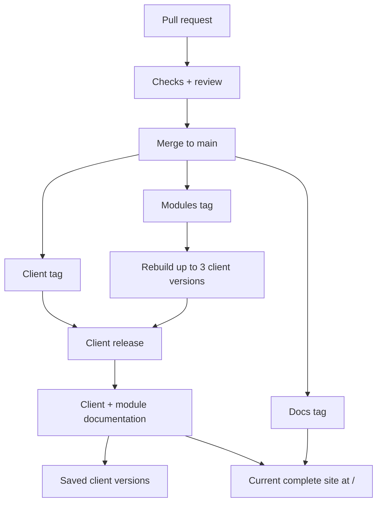

# Release process

A merged pull request changes the source; a release makes that change available to users.
This guide follows your contribution from PR checks to binaries and published documentation.



The current site combines shared pages, client guides, module guides, and generated references in one navigation and search.
The version switcher opens earlier client and module snapshots.

## Where does your change belong?

| Your change | Repository | Documentation beside it |
|-------------|------------|--------------------------|
| CLI, configuration, or VM behavior | `client` | `docs/` |
| Module code, defaults, or metadata | `modules` | `docs/` |
| Shared pages, theme, or navigation | `docs` | `docs/pages/` and `docs/conf.py` |

Update product guides in the repository that owns the behavior.
The site builds them from those sources.

```{important}
Passing checks or merging a PR does not publish a release.
A client tag, a modules tag, or a docs tag starts the matching release path.
```

## Follow your change

- [PR checks and local commands](pull-request-checks)
- [Version numbers and rebuilds](versioning.md)
- [Release paths after merge](release-paths)
- [Documentation publication](published-documentation)

```{toctree}
:hidden:
:maxdepth: 1

workflow
versioning
```
