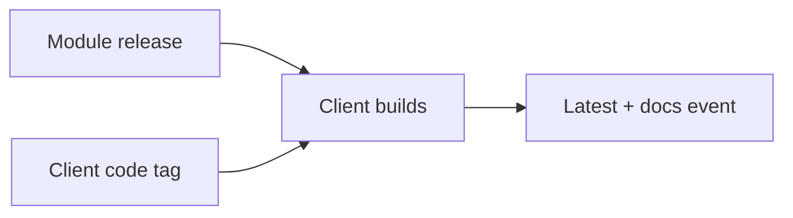

# Release process

**Client releases come from `main`. 
A new module catalog rebuilds up to three existing client versions at their original commits.**



## What starts a release?

| Change                 | Start with                              | Result                                                     |
|------------------------|-----------------------------------------|------------------------------------------------------------|
| Module catalog changes | A modules tag such as `v7`              | Rebuild up to three client base versions with that catalog |
| Client code changes    | A client tag such as `v1.3.0` on `main` | Build and publish that one client version                  |

There are no client release branches or automatic catalog-update PRs. 
A catalog rebuild supplies the new modules tag as a build argument; the client commit stays unchanged.

## Three repositories, three responsibilities

| Repository | Owns                                                                                | Sends or publishes                                                   |
|------------|-------------------------------------------------------------------------------------|----------------------------------------------------------------------|
| `modules`  | Catalog code and `modules/docs/`                                                    | GitHub Release, then a catalog event to `client`                     |
| `client`   | Application code, its default catalog pin, `client/docs/`, and reference generators | Binaries, a record of the included catalog, then one event to `docs` |
| `docs`     | Homepage, release-process pages, theme, and navigation                              | Static documentation site                                            |

**Product guides stay beside their code.** 
Maintainers do not copy those guides into `docs`.

## Read the process in order

1. [Versions and rebuilds](versioning.md) - what a tag means and which three versions stay active.
2. [Release workflow](workflow.md) - how to publish modules or client code, and what each job does.

```{toctree}
:hidden:
:maxdepth: 1

versioning
workflow
```
