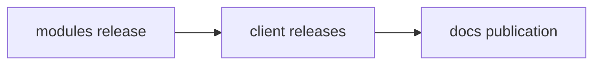

# Release process

Publish a module catalog, build the supported clients with it, then publish documentation for those exact builds.

```{note}
These pages define the agreed release design. 
Configuring the workflows is a separate step.
```



## Repository responsibilities

| Repository | Owns                                                                              | Release result                                                  |
|------------|-----------------------------------------------------------------------------------|-----------------------------------------------------------------|
| `modules`  | Catalog code and `modules/docs/`                                                  | A tagged catalog and a notification to `client`                 |
| `client`   | Client code, its catalog pin, `client/docs/`, and reference generators            | Binaries for a tagged client build and a notification to `docs` |
| `docs`     | The homepage, these process pages, theme, navigation, site build, and publication | One site with documentation for the supported client lines      |

**Keep product documentation beside its code.** 
The site assembles those sources at build time; maintainers do not copy the guides into this repository.

## Start here

| Task                                                         | Read                                     |
|--------------------------------------------------------------|------------------------------------------|
| Understand `v1.2.3+8` or choose a release number             | [Versioning](versioning.md)              |
| Publish modules or release a client change                   | [Release workflow](workflow.md)          |
| Understand source selection and the three published versions | [Documentation builds](documentation.md) |

```{toctree}
:hidden:
:maxdepth: 1

versioning
workflow
documentation
```
