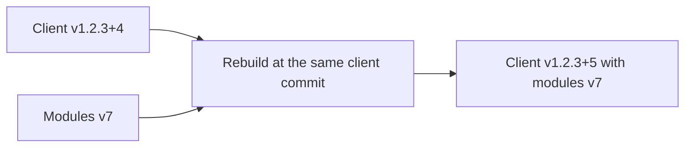

# Versions and rebuilds

The client version, rebuild counter, module catalog version, and docs site version are independent.

## Read a tag

| Tag | Meaning |
|-----|---------|
| Client `v1.2.3` | Client code version 1.2.3, built with its Taskfile catalog pin |
| Client `v1.2.3+4` | Fourth catalog rebuild of client version 1.2.3 |
| Modules `v7` | Catalog revision 7 |
| Docs `v1.0.0` | Version of the shared documentation site |

```{important}
`+4` does not mean modules `v4`.
Client `v1.2.3+4` can contain modules `v7`.
Its GitHub Release records the included catalog in the **Module catalog** link.
```

## What changes in a rebuild?



An automatic rebuild keeps the selected client's commit and passes the new catalog as a build input.
It gets its own tag, binaries, and GitHub Release.

<details>
<summary>Why can the Taskfile still point to an older catalog?</summary>

A new client code release reads `modules_version` from its source `Taskfile.yml`.
A modules event supplies the released catalog tag instead.

For example, the source may still say `modules_version: 'v1'` while a rebuild uses `v7`.
The workflow leaves that source unchanged and records `v7` in the GitHub Release.
Read the release record when you need to know what was bundled.

</details>

## Choose a version

Client code versions use the [SemVer components](https://semver.org/#summary).

| Change from `v1.2.3+4` | Next client tag |
|------------------------|-----------------|
| Rebuild the same code with another catalog | `v1.2.3+5` |
| Compatible bug fix | `v1.2.4` |
| Compatible feature | `v1.3.0` |
| Incompatible client change | `v2.0.0` |

A new code version starts without a rebuild suffix.
Its first catalog rebuild adds `+1`.
The workflow checks tag syntax; it does not decide whether a change is a fix, feature, or breaking change.

<details>
<summary>Check the accepted tag formats</summary>

| Type | Format | Accepted | Rejected |
|------|--------|----------|----------|
| Modules | `vN`, starting at 1 | `v1`, `v7` | `v0`, `v01`, `v1.2.3` |
| Client code | `vMAJOR.MINOR.PATCH` | `v0.1.0`, `v1.2.3` | `v1.2`, `v01.2.3`, `v1.2.3-rc.1` |
| Client rebuild | Code tag followed by `+N` | `v1.2.3+1`, `v1.2.3+12` | `v1.2.3+0`, `v1.2.3+01` |
| Docs site | `vMAJOR.MINOR.PATCH` | `v0.1.0`, `v1.0.0` | `v1.0`, `v1.0.0+1` |

Code and docs version components can be zero.
Leading zeros are rejected, and rebuild counters start at 1.

</details>

<details>
<summary>How does sorting treat +N?</summary>

SemVer calls the suffix after `+` [build metadata](https://semver.org/#spec-item-10) and ignores it when comparing precedence.
LimaNix uses Git version sorting when selecting client releases.
That ordering includes the rebuild number: `v1.2.3+10` comes after `v1.2.3+2`.

</details>

(select-up-to-three-versions)=
## Which clients receive a new catalog?

A modules release rebuilds up to three highest published client base versions.
The base is the full version before `+`, including `PATCH`.
Versions `v1.2.4` and `v1.2.3` count separately.

| Published client tags | Selected source |
|-----------------------|-----------------|
| `v1.3.0` | `v1.3.0` |
| `v1.2.4+10`, `v1.2.4+2`, `v1.2.4` | `v1.2.4+10` |
| `v1.2.3+4`, `v1.2.3+1`, `v1.2.3` | `v1.2.3+4` |
| `v1.2.2+5`, `v1.2.2` | Outside the rebuild window |

With fewer than three base versions, all available versions are selected.
Older releases and their documentation remain available after they leave this window.

<details>
<summary>See how selection works</summary>

1. Find matching client tags with a published GitHub Release.
2. Sort them by Git version order, highest first.
3. Group tags by the base version before `+` and keep the first tag in each group.
4. Return up to three tags and their commit SHAs.

A tag alone does not qualify without a published release.
The shared selector uses a tag glob and does not exclude GitHub prereleases.
Full client tag validation happens later; an unsupported tag can take a selection slot and then fail validation.

</details>
