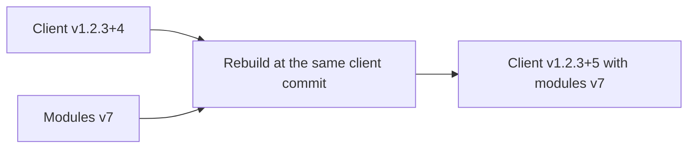

# Versions and rebuilds

The client version, rebuild counter, module catalog version, and docs site
version are independent.

## Read a tag

| Tag | Meaning |
| -- | -- |
| Client `v1.2.3` | Client code version 1.2.3 |
| Client `v1.2.3+4` | Fourth catalog rebuild of client version 1.2.3 |
| Modules `v7` | Catalog revision 7 |
| Docs `v1.0.0` | Version of the shared documentation site |

`+4` does not mean modules `v4`. Client `v1.2.3+4` can contain modules `v7`. Its
GitHub Release identifies the included catalog in the **Module catalog** link.

## What changes in a rebuild?

```mermaid
flowchart LR
    accTitle: Same client code, new module catalog
    accDescr: A modules v7 release rebuilds the selected client v1.2.3+4 as v1.2.3+5 at the same client commit.
    client["Client v1.2.3+4"] --> build["Rebuild at the same client commit"]
    modules["Modules v7"] --> build
    build --> result["Client v1.2.3+5 with modules v7"]
```

An automatic rebuild keeps the selected client's commit and passes the new
catalog as a build input. It gets its own tag, binaries, documentation archive,
and GitHub Release.

A client code release selects a published catalog through the shared
tag-selection action. A modules event supplies its exact catalog tag. The
workflow passes the selected tag to Task as `modules_version`; Task does not
select tags.

## Choose a version

Client code versions use the [SemVer components](https://semver.org/#summary).

| Change from `v1.2.3+4` | Next client tag |
| -- | -- |
| Rebuild the same code with another catalog | `v1.2.3+5` |
| Compatible bug fix | `v1.2.4` |
| Compatible feature | `v1.3.0` |
| Incompatible client change | `v2.0.0` |

A new code version starts without a rebuild suffix. Its first catalog rebuild
adds `+1`.

SemVer treats `+N` as build metadata and ignores it when comparing precedence.
LimaNix uses the numeric suffix to distinguish successive catalog rebuilds of
the same code version.

(supported-client-versions)=

## Which clients receive a new catalog?

The client's module-event workflow uses `RELEASE_COUNT` to limit how many
published client base versions it selects for rebuilding. Set this GitHub
Actions variable in the client repository to a positive integer without leading
zeros. Client code tag releases do not use this count.

The base is the full version before `+`, including `PATCH`. Versions `v1.2.4`
and `v1.2.3` count separately. Within one base version, the selector keeps the
highest rebuild.

For example, with `RELEASE_COUNT=3`:

| Published client tags | Selected source |
| -- | -- |
| `v1.3.0` | `v1.3.0` |
| `v1.2.4+10`, `v1.2.4+2`, `v1.2.4` | `v1.2.4+10` |
| `v1.2.3+4`, `v1.2.3+1`, `v1.2.3` | `v1.2.3+4` |
| `v1.2.2+5` | Outside the rebuild window |

Older releases and their documentation remain available after they leave this
window.
