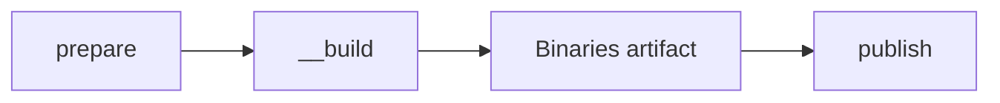

# Release workflow

The client has two entry points: a new code tag or a module-release event. Both use the same build and publication jobs, then finish with one docs notification.

## Find the right workflow

These files live in `client/.github/workflows/`:

| File | Responsibility |
|------|----------------|
| `pr.yml` | Check labels, run Go checks, build macOS binaries, and report `gate` |
| `release.yml` | Receive a tag or catalog event, run the release matrix, then `finalize` |
| `_select.yml` | Produce the list of source tags and commit SHAs |
| `_deploy.yml` | Prepare one release, call the shared build, and publish its binaries |
| `__build.yml` | Build and sign macOS binaries for both PRs and releases |

The PR path checks the proposed code. It does not publish a release. The release path supplies the exact source SHA, release tag, and catalog version to `__build.yml`.

## Release client code

1. Merge the code into `main` through the normal PR checks. Include the intended `modules_version` pin in `Taskfile.yml`.
2. Choose a new [code version](versioning.md), such as `v1.3.0`, and push that tag on the intended commit in `main`.
3. `_select.yml` returns that one tag and its commit SHA.
4. `_deploy.yml` verifies and builds it with the catalog pin from that commit, then publishes its GitHub Release.
5. `finalize` updates Latest and sends one event to docs.

**This releases one client version.** Other active versions are rebuilt when a module event arrives.

Choose a catalog that already has a published modules release. On this path, the client checks the pin's format; it does not check the modules GitHub Release before building.

Client code tags start without `+N`. Tags containing `+` are excluded from the push trigger; publishing a rebuild tag does not start another client release run.

## Release a module catalog

Push a new tag such as `v7` in `modules`, on a commit contained in its `main` branch. The modules `release.yml`:

1. Validates the `vN` format and the commit's membership in `main`.
2. Publishes the module GitHub Release.
3. Sends this event to `client`:

```json
{
  "event_type": "limanix-modules-release",
  "client_payload": {"tag": "v7"}
}
```

The client checks that `v7` is valid and has a published, non-draft, non-prerelease release. It then selects [up to three client base versions](select-up-to-three-versions).

A **matrix** runs the same release jobs once for each selected client. Those jobs run in parallel:

| Selected source tag | New release tag | Included catalog |
|---------------------|-----------------|------------------|
| `v1.3.0` | `v1.3.0+1` | `v7` |
| `v1.2.4+10` | `v1.2.4+11` | `v7` |
| `v1.2.3+4` | `v1.2.3+5` | `v7` |

Each new tag points to the commit selected for its source tag. The catalog is passed as a build argument; the workflow creates no client commit, PR, or release branch.

## Follow one release through `_deploy`



| Job | What it does |
|-----|--------------|
| `prepare` | Validates the source tag, SHA, and `main` ancestry; keeps the code version or increments `+N`; selects and validates the catalog tag |
| `build` | Calls `__build.yml` with the SHA, final release tag, and modules tag; runs `ci/build` on macOS and uploads `limanix-bin-<tag>` |
| `publish` | Downloads that exact artifact and publishes the binaries under the prepared tag, on the selected source commit |

An existing target tag pointing to another commit stops preparation. A failed build stops publication for that client.

The release body records both inputs:

```markdown
Client source: `<commit SHA>`
Module catalog: [v7](https://github.com/limanix/modules/releases/tag/v7)
```

Keep this record with the release, especially when the bundle differs from the source Taskfile pin.

## Finish once with `finalize`

The individual releases publish with `make_latest: false`. After the entire matrix finishes, `finalize`:

1. Finds the highest published client tag using Git version order.
2. Marks that GitHub Release as **Latest**.
3. Gets an App token for `docs` and sends one `limanix-client-release` event, without a tag payload.

Parallel completion order does not decide Latest.

## Understand failures and retries

Client release runs share one queue. Within a run, one failed matrix entry does not cancel the others or roll back their published releases.

| Outcome | What happens next |
|---------|-------------------|
| Selection fails, or no client tags are selected | The release matrix and `finalize` are skipped |
| Some matrix entries fail | Successful releases remain published; `finalize` can still update Latest and notify docs |
| All matrix entries fail | `finalize` can still notify docs if an older published client release exists |
| No published client tag is found during finalization | No Latest update or docs event is sent |
| The run is cancelled | `finalize` is skipped |
| A finalization step fails | Published client releases remain; check that step to determine whether docs was notified |

The docs event requests a refresh from published releases. It is not a success report for every matrix entry.

```{warning}
Before retrying failed jobs from an older run, check its prepared tag and catalog against the current GitHub Release. The workflow accepts an existing target tag on the same SHA, and the publication action can replace existing release assets. A later run may already have used that tag with another catalog. The current workflow does not detect that catalog mismatch.
```

Sending the same catalog event again also starts a new selection and increments the current rebuild counters. It is not treated as an already completed request.

These workflows publish downloadable binaries. They do not update an installed application on a user's Mac.
