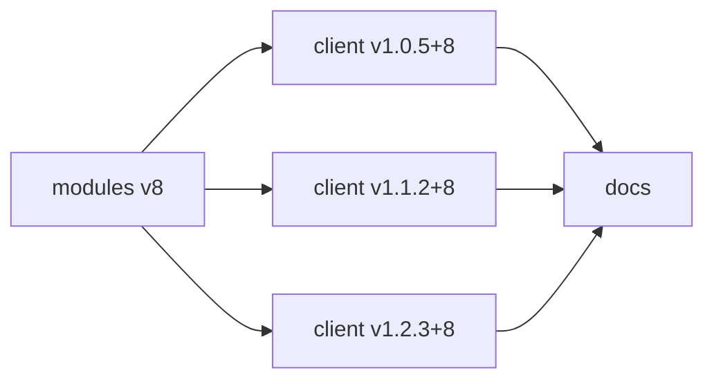

# Release workflow

There are two entry points: a module release or a client code change. 
Both reach `docs` after a client build has been published successfully.

## Release a module catalog

1. Tag the catalog, for example `modules@v8`.
2. Publish its GitHub Release in `modules`.
3. Notify `client` with the exact catalog tag.

The client then handles each of the three supported release lines independently:

1. Update the branch's catalog pin to `v8`.
2. Commit that change and create a new client tag, such as `v1.2.3+8`.
3. Build the binaries and publish the client GitHub Release.
4. Notify `docs` with the full client tag.



The tags in this diagram are examples. 
Each line keeps its own client code version; a catalog update changes only the part after `+`.

```{important}
Release from the supported client branches. 
A module update must not bring unreleased client changes from `main` into those branches.
```

## Release a client change

| Change             | Branch                                     | Example with catalog `v8` |
|--------------------|--------------------------------------------|---------------------------|
| Compatible bug fix | Existing line `v1.2`                       | `v1.2.3+8` → `v1.2.4+8`   |
| New minor line     | Create `v1.3` from selected code in `main` | `v1.3.0+8`                |
| New major line     | Create `v2.0` from selected code in `main` | `v2.0.0+8`                |

For a new line, select the client code and pin the catalog before creating the release tag. 
Build and publish that tagged state, then notify `docs`.

A patch release stays in its existing line. 
It does not add another version to the documentation switcher.

## Handle delayed events and failures

| Situation                                             | Required outcome                                                               |
|-------------------------------------------------------|--------------------------------------------------------------------------------|
| `v7` arrives after a branch already uses catalog `v8` | Keep `v8`; do not roll back the catalog                                        |
| One client line fails to build                        | Keep its previous published client and docs; other lines can complete          |
| A client build has not been published                 | Do not notify `docs` as if the release succeeded                               |
| A build from an older client line finishes last       | Keep overall `Latest` on the newer client version                              |
| Several client releases notify `docs` close together  | Publish site updates in order and preserve the other lines' published sections |

Use the [release ordering rule](versioning.md) to choose the newest build. 
Finish time alone does not determine `Latest`.

These events rebuild and publish client binaries in CI. 
They do not update an installed application on a user's Mac.
